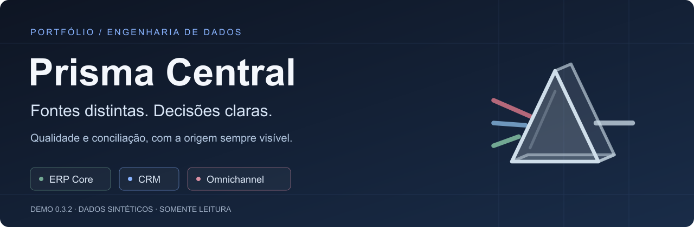
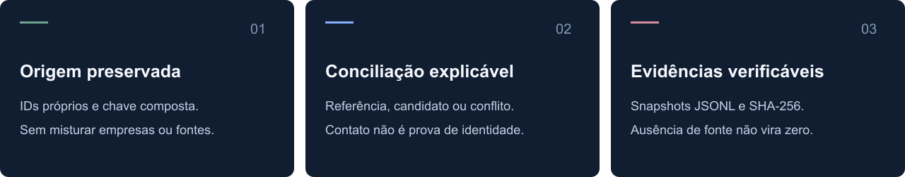
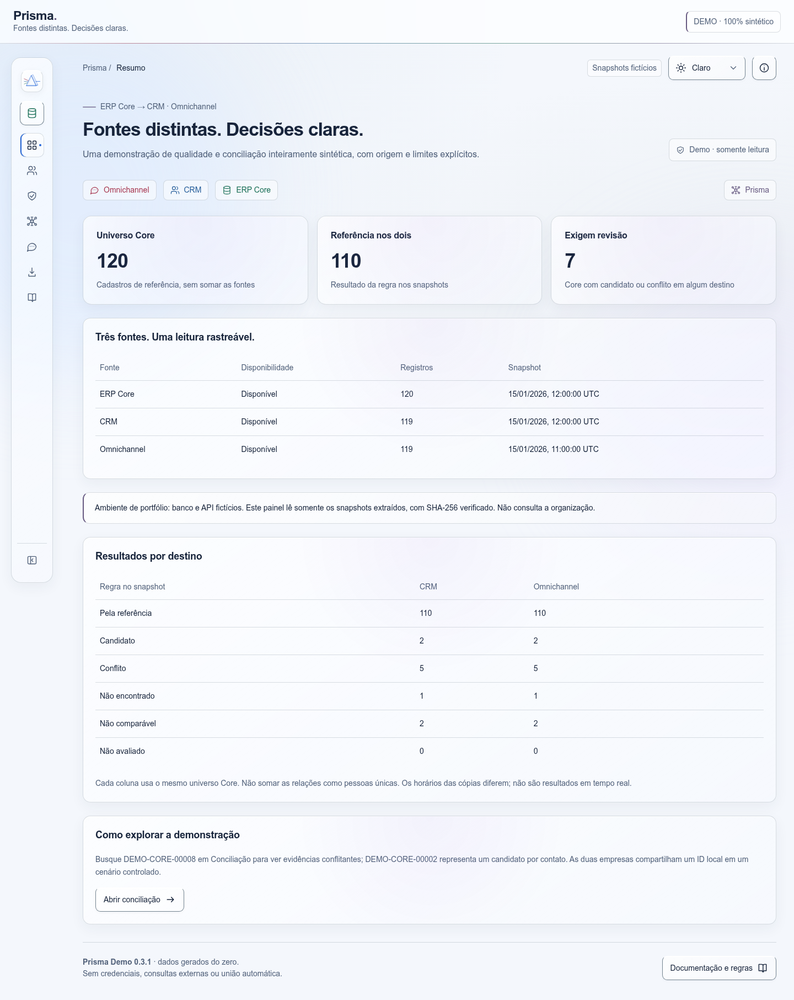
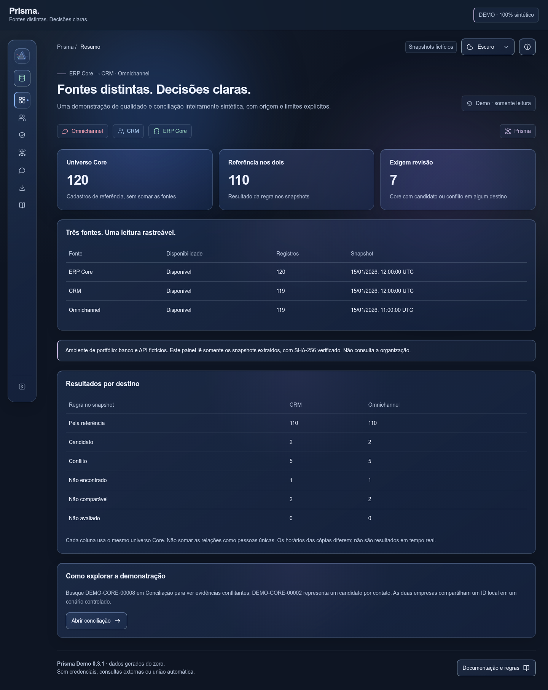

<p align="center">
  
</p>

<p align="center">
  
</p>

<p align="center">
  <a href="https://github.com/kpassaros/prisma-central/actions/workflows/tests.yml"></a>
  
  
  
</p>

<p align="center">
  <a href="#sobre-o-projeto">Sobre</a> ·
  <a href="#o-painel">Painel</a> ·
  <a href="#por-dentro-do-prisma">Arquitetura</a> ·
  <a href="#executar-localmente">Executar</a> ·
  <a href="#escopo-e-limites">Limites</a> ·
  <a href="#autor-e-atividade">Autor</a>
</p>

## Sobre o projeto

**O mesmo cliente em três sistemas não significa três cadastros iguais.**

Um ERP guarda o cadastro de referência. O CRM organiza o relacionamento comercial. O Omnichannel registra contatos e conversas. Cada fonte tem seus próprios IDs, campos e critérios — e as diferenças ficam escondidas quando tudo é tratado como uma única planilha.

O **Prisma Central** é meu projeto de portfólio para explorar esse problema com uma demonstração reproduzível: gerar três fontes fictícias, extrair cópias verificáveis e mostrar onde os cadastros se relacionam, entram em conflito ou não podem ser comparados.

A proposta não é juntar pessoas automaticamente. É tornar a evidência legível antes de qualquer decisão.

> **Demonstração independente, local e somente leitura.** Nomes, empresas, contatos, conversas e mensagens são gerados do zero. Não há dados reais, credenciais, endpoints privados ou conexão com sistemas de uma organização.

<p align="center">
  
</p>

### O que quero demonstrar

- **Integração sem perder contexto:** contratos distintos, paginação por página/cursor e chave composta de empresa + cliente.
- **Qualidade antes de confiança:** campos incompletos, contatos compartilhados e referências conflitantes tratados como cenários de teste.
- **Conciliação com explicação:** uma coincidência de e-mail ou telefone é um candidato, não uma identidade confirmada.
- **Rastreabilidade:** cópias JSONL, manifesto de disponibilidade e hashes; a referência esperada dos testes fica separada do comparador.
- **Leitura acessível:** painel web local, busca, filtros, detalhes e temas claro/escuro/sistema.

## O painel

### Aurora · leitura clara



### Nocturne · foco nas evidências



O prisma triangular e o vidro translúcido fazem parte da identidade do projeto. **Verde identifica ERP Core, azul identifica CRM e vermelho identifica Omnichannel.** Essas cores indicam origem, não qualidade ou confiança.

| Área | O que você encontra |
| --- | --- |
| Resumo | Universo Core, disponibilidade e resultados por destino |
| Cadastros | Registros de cada fonte, IDs próprios, filtros e paginação |
| Qualidade | Filas de preenchimento, sintaxe e valores compartilhados |
| Conciliação | Referências, candidatos, conflitos e evidências por chave |
| Conversas | Histórico de mensagens criado exclusivamente para a demo |
| Snapshots | Manifesto, horários das cópias e hashes verificados |
| Documentação | Regras e limites organizados pelas perspectivas das fontes |

**Para explorar:** busque `DEMO-CORE-00008` em Conciliação para ver evidências conflitantes. `DEMO-CORE-00002` demonstra um candidato por contato. São casos sintéticos controlados, não clientes reais.

## Por dentro do Prisma

```text
Gerador determinístico · seed 42
                  │
                  ▼
          SQLite sintético
                  │
                  ▼
       API GET local · :8787
       ERP Core / CRM / Omnichannel
                  │
                  ▼
       Extrator paginado em loopback
                  │
                  ▼
     JSONL + manifesto + hashes SHA-256
                  │
                  ▼
       Painel web local · :8790
     Qualidade / conciliação / evidências
```

O painel lê **somente os snapshots extraídos**. Depois da extração, a API pode ser encerrada; não precisa continuar ligada para navegar no painel.

A chave Core é `(company_id, customer_id)`. Um ID local pode existir em empresas diferentes. IDs nativos de CRM e Omnichannel não são equiparados aos IDs do ERP, e referências opcionais não escondem inconsistências.

### Tecnologias, sem inflar a stack

<p>
  
  
  
  
  
  
</p>

- **Python + biblioteca padrão:** geração, servidor HTTP, extração, validação e testes `unittest`.
- **SQLite:** base local, relacionamentos e dados reproduzíveis.
- **HTML, CSS, JavaScript e SVG:** interface e identidade visual; sem etapa de build frontend.
- **JSONL + SHA-256:** cópias auditáveis e checagem de integridade.
- **FastAPI / OpenAPI:** adaptador opcional, não requisito para executar o núcleo.

O nome **Prisma Central não indica uso do Prisma ORM**. Não instale o pacote homônimo para rodar esta demo.

## Executar localmente

**Requisito:** Python 3.11 ou superior. O núcleo não exige instalação de bibliotecas externas.

### 1. Clonar e entrar na raiz

```bash
git clone https://github.com/kpassaros/prisma-central.git
cd prisma-central
```

Execute todos os comandos da pasta que contém `README.md` e o diretório `prisma/`, nunca de dentro do módulo. Se usar um ZIP, abra o terminal nessa mesma raiz.

### 2. Gerar e conferir a base fictícia

```bash
python -m prisma generate --customers 120 --seed 42
python -m prisma check
python -m unittest discover -s tests -v
```

### 3. Iniciar a API · terminal A

```bash
python -m prisma serve --port 8787
```

Confira [o health local](http://127.0.0.1:8787/health). Mantenha esse terminal aberto durante a extração.

### 4. Extrair os snapshots · terminal B

Abra outro terminal na **mesma raiz**:

```bash
python -m prisma extract --base-url http://127.0.0.1:8787 --out snapshots
```

O extrator não sobrescreve uma extração existente. Se já tiver uma pasta `snapshots/` íntegra, reutilize-a; para repetir a extração, escolha outro nome com `--out` e use o mesmo caminho no próximo comando.

### 5. Abrir o painel · terminal B

```bash
python -m prisma panel --snapshots snapshots --port 8790
```

Abra **[http://127.0.0.1:8790](http://127.0.0.1:8790)**. Você pode encerrar a API do terminal A com `Ctrl+C` após a extração. Para fechar o painel, use `Ctrl+C` no terminal B.

**Se já tiver snapshots:** basta executar o comando do painel. Não regenere a base apenas para abrir a interface. O nome técnico `prisma_demo.sqlite` foi mantido para compatibilidade.

<details>
<summary><strong>Adaptador opcional FastAPI / OpenAPI</strong></summary>

Crie um ambiente virtual:

```bash
python -m venv .venv
```

Ative no PowerShell:

```powershell
.\.venv\Scripts\Activate.ps1
```

Ou no Linux/macOS:

```bash
source .venv/bin/activate
```

Instale as dependências opcionais e inicie a API:

```bash
python -m pip install -r requirements-api.txt
python -m prisma serve --engine fastapi --port 8787
```

OpenAPI: `http://127.0.0.1:8787/openapi.json`. Swagger: `http://127.0.0.1:8787/docs`.

Os assets padrão do Swagger usam CDN. O adaptador está incluído, mas não foi executado na validação local sem essas dependências; o servidor padrão é o caminho principal da demo.

</details>

## Cenários que tornam a demo útil

A base padrão contém **120 cadastros Core em duas empresas fictícias**, além de registros próprios de CRM/Omnichannel, 20 conversas e 60 mensagens sintéticas. Não são indicadores de negócio.

| Situação simulada | Como a demo a trata |
| --- | --- |
| Referência explícita, única e sem evidência conflitante | Pela referência; não é validação de identidade civil |
| Contato coincidente sem referência | Candidato, sem fusão |
| Contato compartilhado ou evidências divergentes | Conflito para revisão |
| Dados insuficientes ou campos inválidos | Não comparável |
| Core sem correspondente em uma cópia | Não encontrado naquele snapshot |
| Mesmo ID local em empresas distintas | Chaves compostas preservadas |
| Fonte indisponível | Não avaliada; nunca convertida em contagem zero |

Existem dez cenários de aceitação, incluindo referência duplicada e contato parcial. Snapshots podem ter horários diferentes: a leitura não representa presença em tempo real.

### Verificação e testes

A validação local da versão **0.3.2**, em Linux/Python 3.13, registrou **49 testes: 48 aprovados e 1 opcional FastAPI ignorado** por ausência de dependências. Os testes cobrem geração, integridade, paginação, extração HTTP, regras da demo e proteções do carregador.

O status remoto atual é apresentado pelo badge do workflow no topo. Ele é independente da validação local; as imagens de estatísticas não substituem testes ou homologação.

## Escopo e limites

- Não há sincronização automática, escrita entre fontes ou fusão de pessoas.
- Coincidência de contato e confirmação por referência **não comprovam identidade civil, consentimento ou autorização de atualização**.
- O comparador é simplificado: não implementa validação civil, score ou avaliação temporal completa.
- Hashes detectam alterações em relação ao manifesto; não garantem sozinhos origem ou autenticidade. O carregador também confere as convenções sintéticas.
- API e painel são restritos a loopback. **Não os publique na internet**: não são serviços autenticados, multiusuário ou prontos para produção.
- A demo não depende de arquivos `.env`, bases reais ou conectores privados.

## Estatísticas do repositório

<p>
  <a href="https://github.com/kpassaros/prisma-central/stargazers"></a>
  <a href="https://github.com/kpassaros/prisma-central/forks"></a>
  
  <a href="https://github.com/kpassaros/prisma-central/commits/main/"></a>
</p>

[Ver linguagens e atividade diretamente no repositório →](https://github.com/kpassaros/prisma-central)

## Autor e atividade

**Kaíque Passaros** · Tecnologia, dados e integração.

Gosto de trabalhar no ponto em que dados dispersos precisam virar uma leitura confiável. O Prisma Central traduz essa preocupação em algo que pode ser explorado: origem visível, regras explícitas e limites documentados.

Os cards abaixo pertencem ao **perfil `kpassaros`**, não exclusivamente ao Prisma Central. Top languages representa os repositórios considerados pelo serviço; streak e activity graph representam contribuições do perfil, não desempenho ou qualidade deste projeto.

<p align="center">
  <a href="https://github.com/kpassaros"></a>
  <a href="https://github.com/kpassaros?tab=repositories"></a>
</p>

<p align="center">
  <a href="https://github.com/kpassaros"></a>
</p>

<p align="center">
  <a href="https://github.com/kpassaros"></a>
</p>

**Nota sobre os cards dinâmicos:** dependem de serviços externos, suas regras de contagem, cache e disponibilidade. Os endpoints não foram verificados nesta entrega offline. Se uma imagem não carregar, use [o perfil no GitHub](https://github.com/kpassaros) para consultar a atividade diretamente. Nenhum número foi fixado ou simulado para compor os cards.

## Documentação e uso do código

- [Contrato da API](docs/API.md)
- [Painel da demo](docs/PAINEL_DEMO.md)
- [Identidade visual](docs/IDENTIDADE_VIDRO.md)
- [Validação e histórico de versões](docs/VALIDACAO.md)
- [Cuidados para publicação](docs/PUBLICACAO.md)

Este repositório foi preparado como **portfólio**. Nenhuma licença open source foi adicionada a esta entrega; a disponibilidade pública não deve ser interpretada como concessão de uma licença permissiva. Para discutir reutilização, entre em contato com o autor.

---

<p align="center"><strong>Fontes distintas. Decisões claras.</strong><br />Prisma Central · Portfólio de Kaíque Passaros</p>
